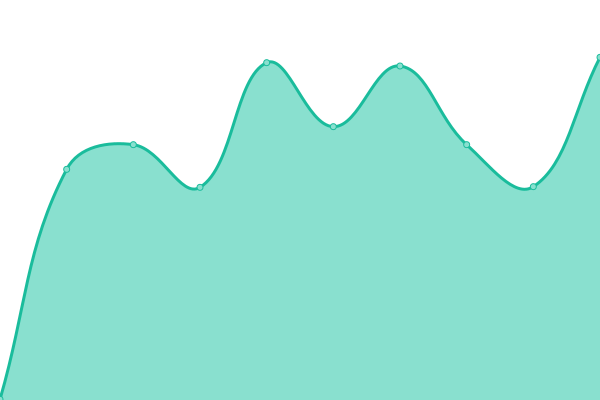
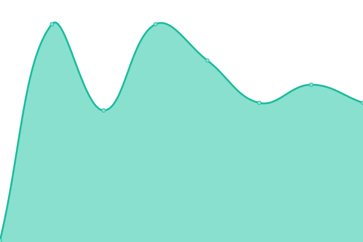

Yutube video tutorial: https://www.youtube.com/watch?v=n_Fc7BHM-yE

# Getting Started:

https://upptime.js.org/docs/get-started

# [📈 Live Status](https://vkuttyp.github.io/myupptime): <!--live status--> **🟩 All systems operational**

This repository contains the open-source uptime monitor and status page for [Kutty](https://vkuttyp.github.io/myupptime), powered by [Upptime](https://github.com/upptime/upptime).

With [Upptime](https://upptime.js.org), you can get your own unlimited and free uptime monitor and status page, powered entirely by a GitHub repository. We use [Issues](https://github.com/vkuttyp/myupptime/issues) as incident reports, [Actions](https://github.com/vkuttyp/myupptime/actions) as uptime monitors, and [Pages](https://vkuttyp.github.io/myupptime) for the status page.

<!--start: status pages-->
<!-- This summary is generated by Upptime (https://github.com/upptime/upptime) -->
<!-- Do not edit this manually, your changes will be overwritten -->
<!-- prettier-ignore -->
| URL | Status | History | Response Time | Uptime |
| --- | ------ | ------- | ------------- | ------ |
|  [nakhlasalama](https://nakhlasalama.com) | 🟩 Up | [nakhlasalama.yml](https://github.com/vkuttyp/myupptime/commits/HEAD/history/nakhlasalama.yml) | 

 602ms
     
 | 

<a href="https://vkuttyp.github.io/myupptime/history/nakhlasalama">100.00%</a>
    

|  [murshisoft](https://murshisoft.com) | 🟩 Up | [murshisoft.yml](https://github.com/vkuttyp/myupptime/commits/HEAD/history/murshisoft.yml) | 

 564ms
     
 | 

<a href="https://vkuttyp.github.io/myupptime/history/murshisoft">100.00%</a>
    

|  customersnginx | 🟩 Up | [customersnginx.yml](https://github.com/vkuttyp/myupptime/commits/HEAD/history/customersnginx.yml) | 

 405ms
     
 | 

<a href="https://vkuttyp.github.io/myupptime/history/customersnginx">100.00%</a>
    

|  customersapiwinserver | 🟩 Up | [customersapiwinserver.yml](https://github.com/vkuttyp/myupptime/commits/HEAD/history/customersapiwinserver.yml) | 

 217ms
     
 | 

<a href="https://vkuttyp.github.io/myupptime/history/customersapiwinserver">100.00%</a>
    

<!--end: status pages-->

[**Visit our status website →**](https://vkuttyp.github.io/myupptime)

## 📄 License

- Powered by: [Upptime](https://github.com/upptime/upptime)
- Code: [MIT](./LICENSE) © [Anand Chowdhary](https://anandchowdhary.com), supported by [Pabio](https://pabio.com)
- Data in the `./history` directory: [Open Database License](https://opendatacommons.org/licenses/odbl/1-0/)
